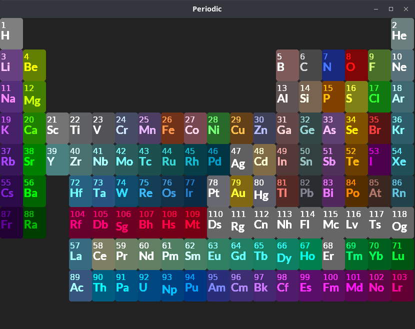

# Periodic
Visualize elements of the periodic table.
Written by Ben Cottrell and released under version 3 of the GNU GPL.



## Building on Linux (Ubuntu)
First, make sure you have the dependencies for cinder by installing these packages with:
```
sudo apt install libxcursor-dev libxrandr-dev libxinerama-dev libxi-dev libgl1-mesa-dev libglu1-mesa-dev \
zlib1g-dev libfontconfig1-dev libcurl4-gnutls-dev \
libmpg123-dev libsndfile1 libsndfile1-dev libpulse-dev libasound2-dev \
libgstreamer1.0-dev libgstreamer-plugins-bad1.0-dev libgstreamer-plugins-base1.0-dev gstreamer1.0-libav \
gstreamer1.0-alsa gstreamer1.0-pulseaudio gstreamer1.0-plugins-bad
```

You will need to get Cinder and jsoncpp from:
 - https://github.com/cinder/Cinder.git
 - https://github.com/open-source-parsers/jsoncpp.git
 
Change the paths for Cinder and jsoncpp in CMakeLists.txt,
 then run these commands to configure and build:
```shell
cmake -B build
cmake --build build
```

## Building on Windows 10
TODO: This will be in a new branch containing a Visual Studio solution and project file.
I have tested this out though.

## Data Sources
The data for the file in `assets/elements-data.json` was taken from pubchem.ncbi.nlm.nih.gov 


